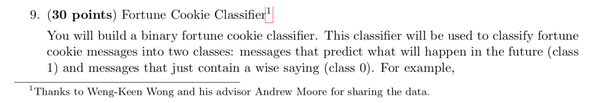
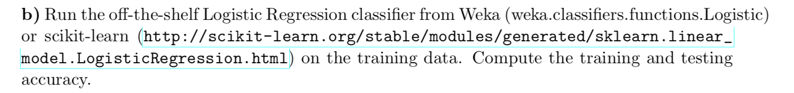

# NaiveBayes

OUTPUT: ========================= Naive Bayes train accuracy:
97.83%
Naive Bayes test accuracy:
71.29%
scikit-learn Naive Bayes train accuracy:
97.52%
scikit-learn Naive Bayes test accuracy:
65.35%
scikit-learn Logistic Regression train accuracy:
97.52%
scikit-learn Logistic Regression test accuracy:
65.35% =========================
